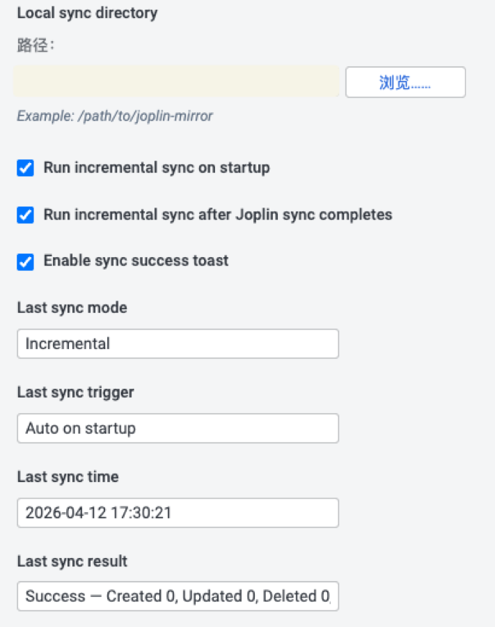

# Joplin Markdown Mirror

Mirror your Joplin notes into a local Markdown directory for indexing, personal RAG workflows, archives, and other file-based tooling.



## What it does

Joplin Markdown Mirror keeps a local Markdown mirror of your Joplin notes so the files can be consumed outside Joplin.

It is designed for workflows where your notes need to stay readable and usable as plain files, while still being easy to sync from inside Joplin.

## Core workflow

### 1. Choose a local sync directory
Set `Local sync directory` in the `Joplin Markdown Mirror` settings section.

This directory becomes the destination for mirrored Markdown notes.

### 2. Run a sync command
The plugin provides two commands:

- `Joplin Markdown Mirror: Full Sync`
- `Joplin Markdown Mirror: Incremental Sync`

`Full Sync` rewrites the mirror and asks for confirmation first.

`Incremental Sync` only applies detected changes.

### 3. Let automatic sync keep the mirror fresh
Optional settings are available for:

- `Run incremental sync on startup`
- `Run incremental sync after Joplin sync completes`

These let the mirror update automatically without manual command runs every time.

### 4. Check sync status in settings
The plugin writes the latest sync result back into settings so you can quickly see:

- `Last sync mode`
- `Last sync trigger`
- `Last sync time`
- `Last sync result`

## Settings

All plugin settings live under the `Joplin Markdown Mirror` section.

### Available options

- `Local sync directory`
- `Run incremental sync on startup`
- `Run incremental sync after Joplin sync completes`
- `Enable sync success toast`
- `Last sync mode`
- `Last sync trigger`
- `Last sync time`
- `Last sync result`

`Enable sync success toast` is on by default and controls whether successful syncs show toast notifications.

## Commands

The plugin registers these commands in Joplin:

- `Joplin Markdown Mirror: Full Sync`
- `Joplin Markdown Mirror: Incremental Sync`

Use these from the command palette or any Joplin UI surface that can invoke plugin commands.

## Notes and caveats

- The plugin mirrors notes as local Markdown files; it does not perform embeddings or retrieval itself.
- Success toast behavior depends on Joplin's native notification system.
- The mirror is intended to be consumed by downstream tooling such as personal RAG pipelines, local search, static processing, or archival workflows.

## Installation

### From Joplin plugin settings
Once the plugin is indexed by the official Joplin plugin directory, install it from Joplin's plugin manager.

### From a `.jpl` file
You can also install the packaged plugin manually from a built release asset.

## Local development

```bash
npm install
npm test
npm run dist
```

The packaged plugin is written to:

```text
publish/com.sarsmini.joplin-md-mirror.jpl
```

## Repository

- Homepage: https://github.com/Sars666/joplin-md-mirror
- Issues and source: https://github.com/Sars666/joplin-md-mirror

## License

MIT
